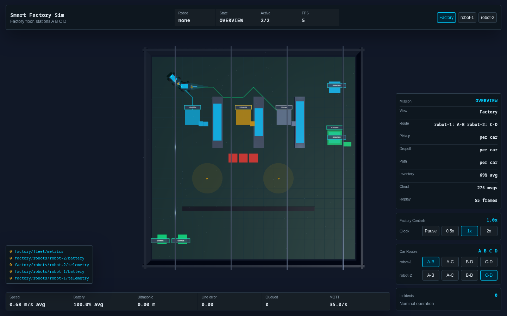
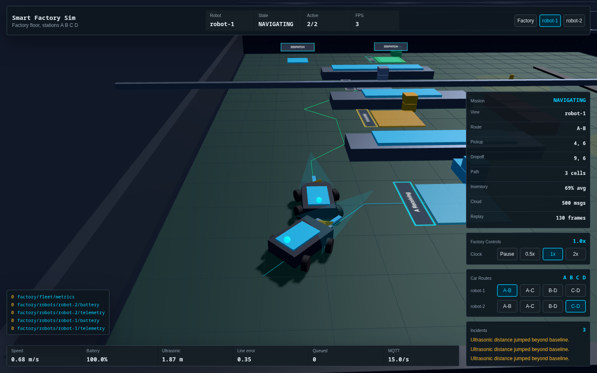
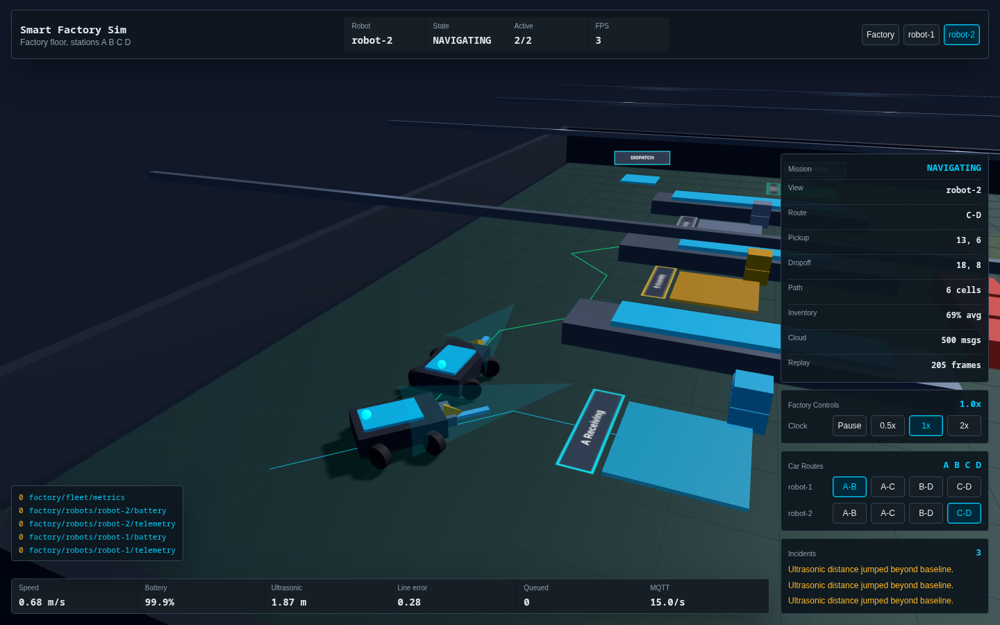
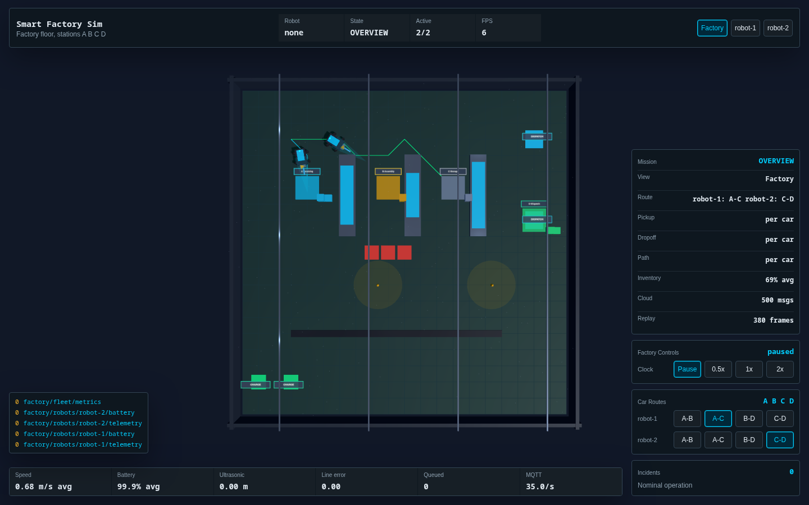
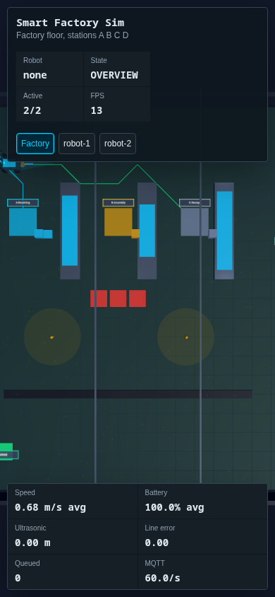

# Smart Factory Sim

A cinematic industrial control room in the browser, where autonomous logistics robots, MQTT telemetry, workers, shelves, and factory systems run as one virtual digital twin.


## Demo Media

Video walkthrough: [smart-factory-demo.webm](docs/media/smart-factory-demo.webm)

| Factory overview | Robot 1 POV |
|---|---|
|  |  |

| Robot 2 POV | Route reassignment |
|---|---|
|  |  |

| Paused controls | Mobile overview |
|---|---|
|  |  |

## Architecture

```text
RobotController -> DigitalTwin -> MQTTBroker -> TelemetryStore
       |               |              |              |
       v               v              v              v
  StateMachine    SceneManager     MQTTPanel      ReplayRecorder
       |               |              |
       v               v              v
 FactoryWorld -> FleetManager -> UIManager
```

## Features

### Robotics

- Differential-drive robot kinematics with wheel RPM, slip flags, velocity, heading, and path following.
- Typed finite state machine for idle, navigation, blocked, loading, transport, unloading, charging, error, and emergency stop states.
- Battery, maintenance, servo arm, anomaly, and telemetry models.
- Two visible logistics cars with cargo crates, lift-arm movement, and steering wheels that yaw through turns.

### Factory

- Scenario-driven shelves, conveyors, loading docks, chargers, workers, hazards, zones, and shifts.
- Recognizable factory shell with perimeter walls, overhead beams, charger pads, dispatch docks, merchandise stacks, and stations A, B, C, and D.
- Worker safety bubbles and autonomous route movement.
- Weighted navigation grid and A* path planning.

### Industrial IoT

- In-browser MQTT broker with subscriptions, wildcard routing, retained messages, QoS metadata, and LWT support.
- Observable digital twin as the authoritative robot state.
- Simulated OPC-UA node tree, edge preprocessing, cloud sink, telemetry store, and replay recorder.

### Visualization

- Three.js factory floor with shelves, conveyors, worker safety zones, robot meshes, sensor cones, path lines, lighting, and ambient particles.
- Simulation-first HUD with factory overview, per-car POV buttons, configurable A-B/A-C/B-D/C-D routes, speed controls, telemetry, incidents, and MQTT feed.

## Quick Start

```bash
pnpm install
pnpm dev
pnpm test
```

Open the Vite URL printed by `pnpm dev`.

## Docker

```bash
docker build -t smart-factory-sim:local .
docker run --rm -p 8080:8080 smart-factory-sim:local
```

Open `http://localhost:8080`, or use Compose:

```bash
docker compose up --build
```

See [Docker docs](docs/DOCKER.md) for runtime details.

## CI Pipeline

Pull requests run the core CI workflow for pnpm install, lint, tests, and production build. Docker-related changes also run Compose validation and a production image build. See [CI Pipeline](docs/CI_PIPELINE.md).

## Simulation Controls

| Control | Behavior |
|---|---|
| `Factory` | Returns to the full factory overview camera. |
| `robot-1`, `robot-2` | Switches to the selected car POV and follows that vehicle. |
| `A-B`, `A-C`, `B-D`, `C-D` | Reassigns a car route through stations A, B, C, and D without changing the current camera POV. |
| `Pause`, `0.5x`, `1x`, `2x` | Changes the simulation clock speed without resetting the scene. |

The default workflow sends both cars through pickup, load, transport, unload, drive-to-charger, and charge phases. Cargo crates appear on the car after loading and disappear after discharge. Camera control is explicit: only `Factory`, `robot-1`, and `robot-2` change the view.

## Built-In Scenarios

| Scenario | Demonstrates |
|---|---|
| Small Warehouse | First-load baseline with two robots, shelves, conveyor, docks, workers, and chargers. |
| Large Industrial Facility | Fleet congestion, larger navigation spaces, and mixed task priority. |
| Chaos Stress Test | High pressure routing, blocked cells, dense workers, and failure hooks. |
| Night Shift | Low-light factory operation and critical restocking. |
| Multi-Robot Swarm | Ten-robot coordination and conflict-heavy routing. |

## Tech Stack

| Tool | Version | Rationale |
|---|---:|---|
| TypeScript | 5.3+ | Strict compile-time contracts for simulation state and telemetry. |
| Vite | 5+ | Fast browser development with ESM and simple Three.js integration. |
| Three.js | r160+ | Mature 3D rendering engine for procedural factory and robot visuals. |
| Vitest | 1+ | Fast unit tests for core simulation logic. |
| ESLint | 8+ | Static checks for strict TypeScript and maintainable APIs. |
| pnpm | 9+ | Deterministic installs and workspace support. |

## Project Structure

```text
config/      Typed configs and scenario JSON
firmware/    Virtual Arduino firmware mirror
public/      Vite HTML entry and favicon
src/core/    Event bus, clock, scheduler, replay, logger, profiler
src/physics/ Kinematics, PID, collision, friction, payload math
src/robot/   Robot state, controller, battery, maintenance, telemetry
src/iot/     MQTT, digital twin, OPC-UA, edge, cloud, telemetry store
src/rendering/ Three.js scene, materials, objects, effects
src/ui/      Dashboard panels and controls
tests/       Focused unit tests
```

## Documentation

- [Documentation Index](docs/README.md)
- [Docker](docs/DOCKER.md)
- [CI Pipeline](docs/CI_PIPELINE.md)
- [PLAN.md](PLAN.md)
- [ARCHITECTURE.md](ARCHITECTURE.md)
- [DIGITAL_TWIN.md](DIGITAL_TWIN.md)
- [MQTT_SPEC.md](MQTT_SPEC.md)
- [PHYSICS.md](PHYSICS.md)
- [FIRMWARE.md](FIRMWARE.md)
- [SCENARIO_GUIDE.md](SCENARIO_GUIDE.md)
- [CONTRIBUTING.md](CONTRIBUTING.md)
- [CHANGELOG.md](CHANGELOG.md)
- [DEVLOG.md](DEVLOG.md)
